<p align="center"></p>

<h1 align="center">Слово.Проповеди</h1>

<div align="center">

[](https://git.lightnode.ru/Slovo_Propovedi/slovo-propovedi-mobile/releases/latest) [](https://git.lightnode.ru/Slovo_Propovedi/slovo-propovedi-mobile/releases/latest) [](https://app.slovo-propovedi.ru/) [](LICENSE)

</div>

<div align="center">

[English](README.en.md) | **Русский**

</div>

<p align="center">
  Приложение для прослушивания христианских проповедей онлайн и офлайн.<br/>
  <b>Без рекламы, без отслеживания, без аналитики — конфиденциальность прежде всего.</b>
</p>

## 📱 Скриншоты

<table>
  <tr>
    <td align="center">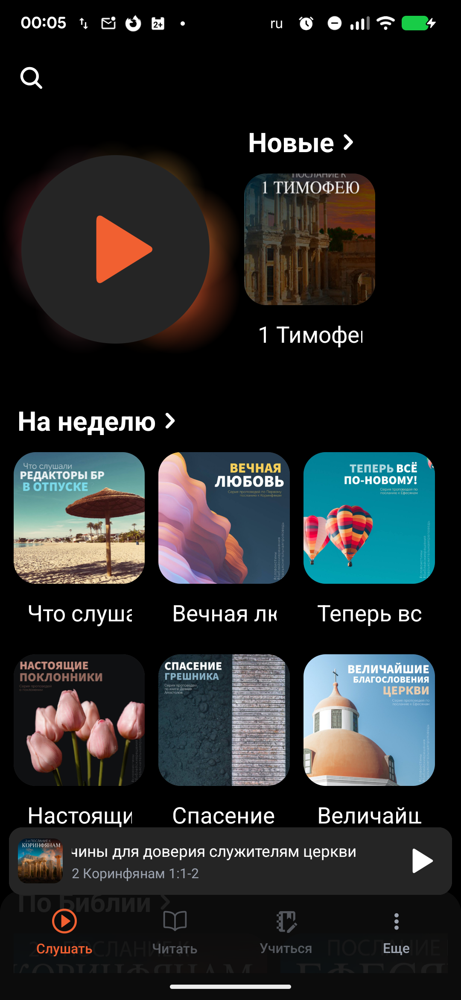<br/>Слушать (тёмная тема)</td>
    <td align="center">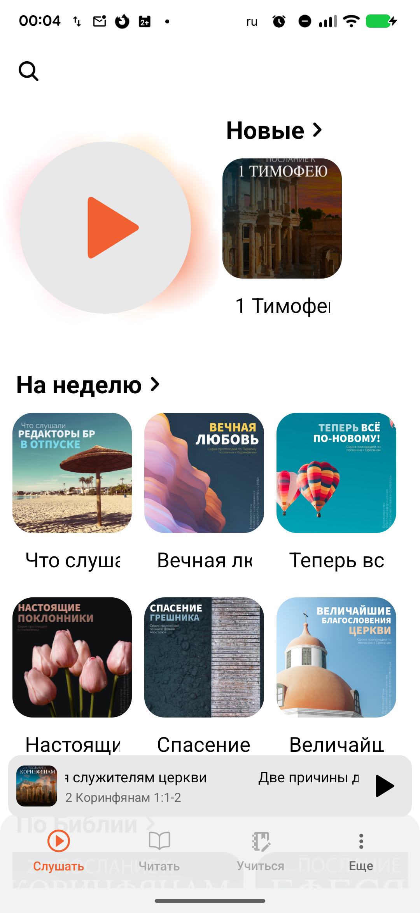<br/>Слушать</td>
    <td align="center"><br/>Список плейлистов</td>
  </tr>
  <tr>
    <td align="center">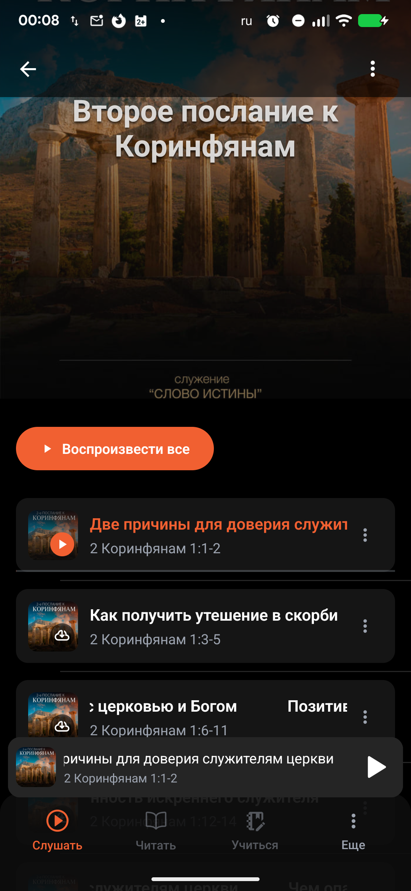<br/>Плейлист</td>
    <td align="center">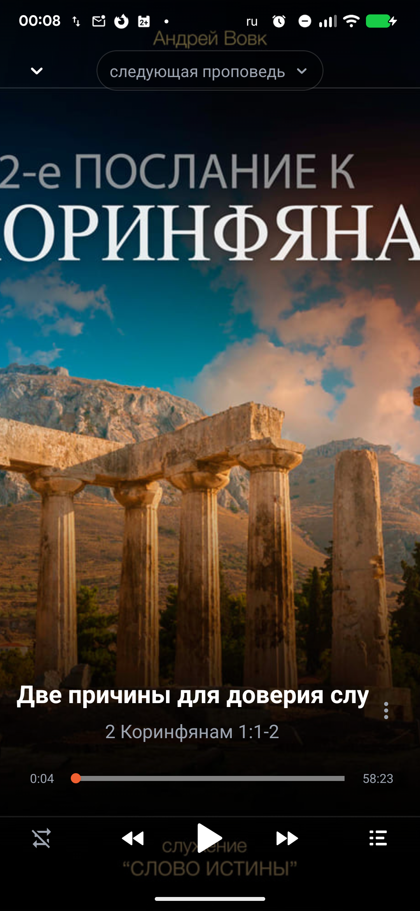<br/>Плеер</td>
    <td align="center">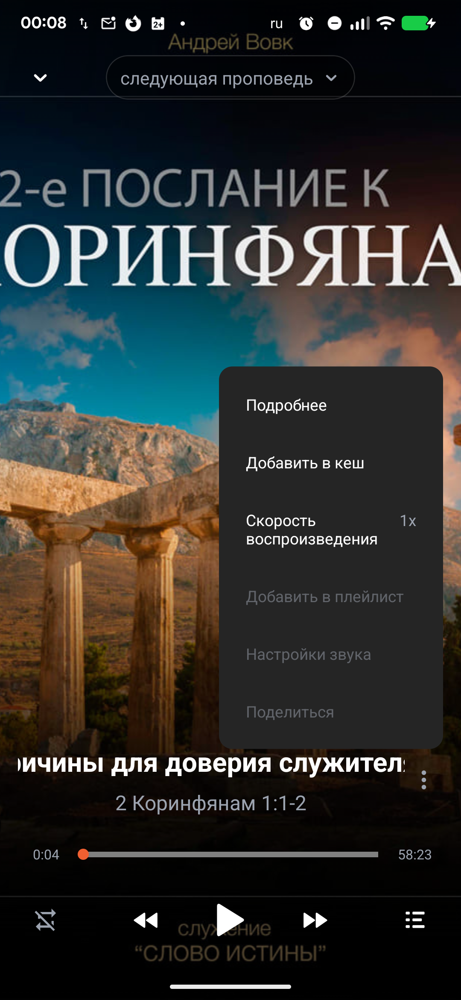<br/>Меню плеера</td>
  </tr>
  <tr>
    <td align="center"><br/>Плейлист в шторке</td>
    <td align="center">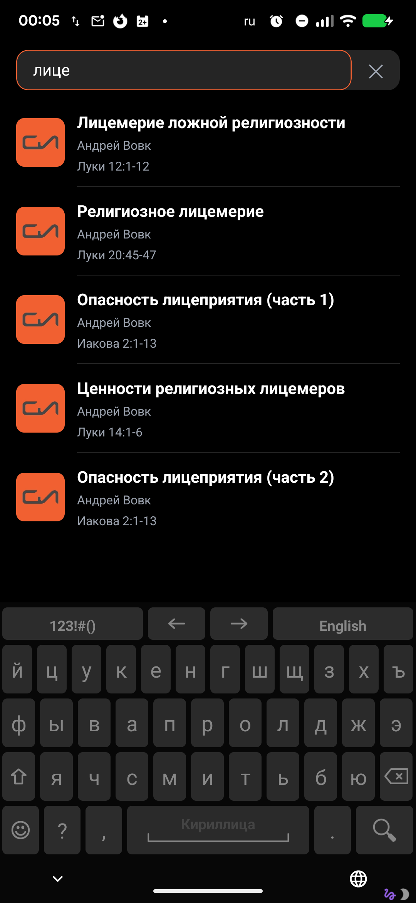<br/>Поиск</td>
    <td align="center">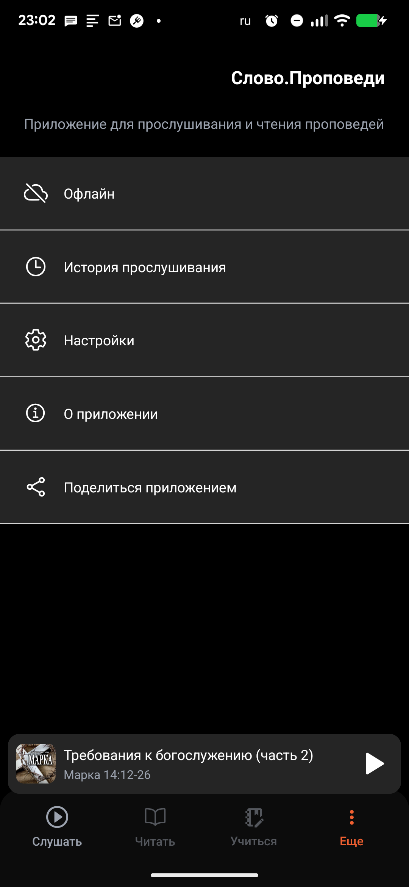<br/>Ещё</td>
  </tr>
</table>

<table>
  <tr>
    <td align="center">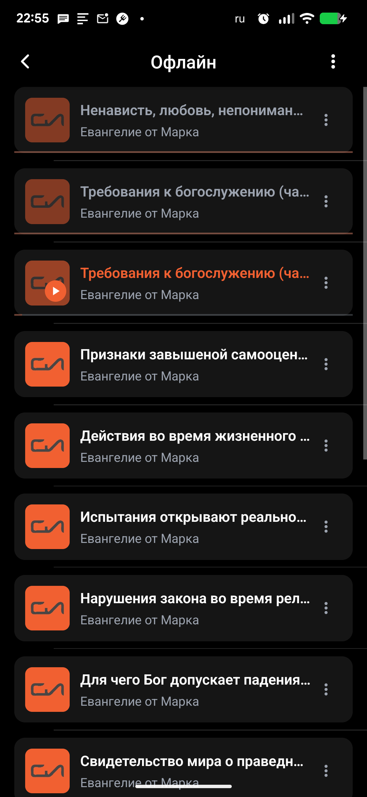<br/>Офлайн</td>
    <td align="center">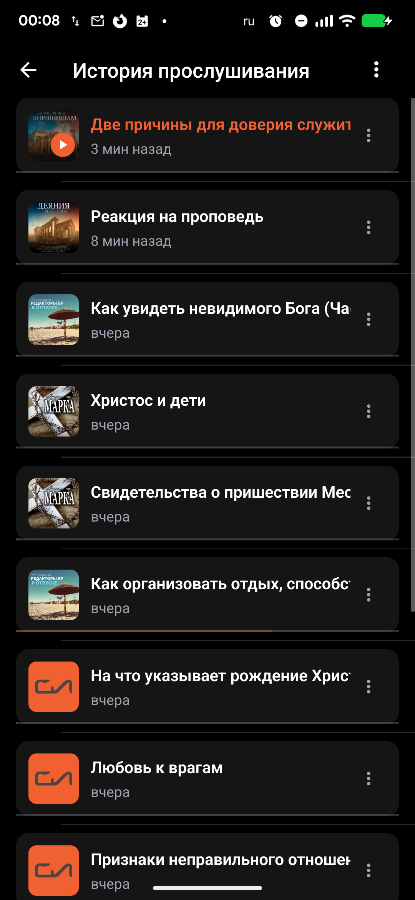<br/>История прослушивания</td>
    <td align="center">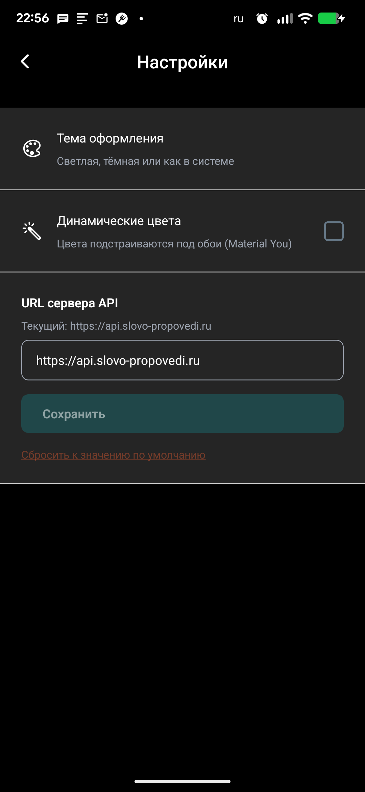<br/>Настройки</td>
  </tr>
  <tr>
    <td align="center"><br/>Поделиться</td>
    <td align="center">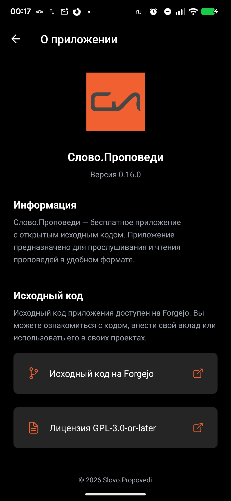<br/>О приложении</td>
  </tr>
</table>

## ✨ Ключевые возможности

### 🎧 Прослушивание

- **Потоковое аудио** — воспроизведение проповедей прямо с сервера.
- **Полноэкранный плеер** — фоновое воспроизведение, управление с экрана блокировки и из уведомления.
- **История прослушивания** — возврат к проповеди с сохранённой позиции.
- **Поиск** — поиск проповедей с кешированием результатов.

### 📁 Плейлисты

- **Список плейлистов** — все ваши подборки в одном месте.
- **Добавление в плейлист** — через нижнюю шторку (bottom sheet) прямо из плеера.

### 📥 Офлайн

- **Кеширование аудио** — полная загрузка проповеди для прослушивания без сети.
- **Экран «Офлайн»** — список скачанных проповедей с воспроизведением без интернета.
- **Очистка офлайн-кеша** — удаление загруженных файлов одним действием.
- **Устойчивость к сбоям сети** — автоматический переход на офлайн-источник при потере соединения.

### 🎨 Современный интерфейс

- **Тёмная и светлая темы** — переключение автоматически по системной настройке.
- **Плавные анимации** — отзывчивые переходы и жесты.
- **Русскоязычный интерфейс** — весь текст приложения на русском.

### 🔧 Гибкость и приватность

- **Настраиваемый сервер** — подключение к любому совместимому серверу проповедей.
- **Без рекламы, отслеживания и аналитики** — никаких трекеров и сбора данных.
- **Уведомления об обновлениях** — проверка новых версий приложения.
- **Веб-версия** — PWA с офлайн-кешированием аудио.

## 📥 Загрузка

| Источник | Ссылка |
| --- | --- |
| **F-Droid** | _Ссылка будет добавлена после публикации_ |
| **Веб-версия (PWA)** | [](https://app.slovo-propovedi.ru/) |
| **Прямая загрузка APK** | [](https://git.lightnode.ru/Slovo_Propovedi/slovo-propovedi-mobile/releases/latest) |

## 📋 Системные требования

- **Android** — современная версия Android; приложение доступно также как APK-сборка.
- **Веб** — любой современный браузер (PWA, устанавливается как приложение, поддерживает офлайн-кеш аудио).

Приложение запрашивает только необходимые разрешения: настройка аудио, фоновый сервис и воспроизведение мультимедиа, уведомления, установка обновлений. Доступ к микрофону (`RECORD_AUDIO`) явно запрещён — приложение только воспроизводит звук.

## 🛠️ Используемые технологии

| Технология | Версия |
| --- | --- |
|  | 0.86.3 |
|  | ~57.0.24 |
|  | ~6.0.3 |
|  | @reatom/* |
|  | expo-router |
|  | expo-audio |
|  | ^1.19.0 |
|  | ^1.6.11 |

## 🚀 Планы

- **Чтение FB2-книг** — онлайн-чтение христианских книг в формате FB2 с сервера (без локальных файлов).

## 🔨 Сборка из исходников

**Требования:** Node.js (LTS), Yarn, Git.

```bash
# Клонировать репозиторий
git clone https://git.lightnode.ru/Slovo_Propovedi/slovo-propovedi-mobile.git
cd slovo-propovedi-mobile

# Установить зависимости
yarn install

# Запустить сервер разработки
yarn start        # нативное приложение (Expo Dev Server)
yarn web          # веб-версия
```

Релизная сборка Android выполняется через EAS:

```bash
yarn build:android
```

Подробности об архитектуре проекта, системе сборки и скриптах разработки см. в [DEVELOPMENT.md](DEVELOPMENT.md).

## 🤝 Участие в разработке

1. Создайте ветку для изменения (`feature/...`, `fix/...`).
2. Соблюдайте архитектуру Feature-Sliced Design и обновляйте документацию в `docs/` вместе с кодом.
3. Оформляйте коммиты по [Conventional Commits](https://www.conventionalcommits.org/).
4. Откройте merge request с описанием изменений.

Полное руководство по настройке окружения, стандартам кода и процессу участия — в [CONTRIBUTING.md](CONTRIBUTING.md).

## 📄 Лицензия

Этот проект является свободным открытым программным обеспечением, распространяемым под лицензией **GNU General Public License v3.0 или новее** ([GPL-3.0-or-later](LICENSE)).

Распространение через Apple App Store и Google Play Store разрешено в соответствии с [Дополнительным разрешением для магазинов приложений](ADDITIONAL-PERMISSIONS.md).

- **Исходный код**: https://git.lightnode.ru/Slovo_Propovedi/slovo-propovedi-mobile
- **Отчёты об ошибках и связь**: https://git.lightnode.ru/Slovo_Propovedi/slovo-propovedi-mobile/issues
- **Текст лицензии**: [LICENSE](LICENSE)
- **Сторонние лицензии**: [THIRD-PARTY-LICENSES.md](THIRD-PARTY-LICENSES.md)
- **Авторы**: [AUTHORS](AUTHORS)
- **История изменений**: [CHANGELOG.md](CHANGELOG.md)

---

<p align="center">
  Если приложение оказалось полезным — поставьте звёздочку в репозитории и расскажите о нём.<br/>
  Отзывы, идеи и отчёты об ошибках приветствуются в <a href="https://git.lightnode.ru/Slovo_Propovedi/slovo-propovedi-mobile/issues">трекере задач</a>.
</p>
