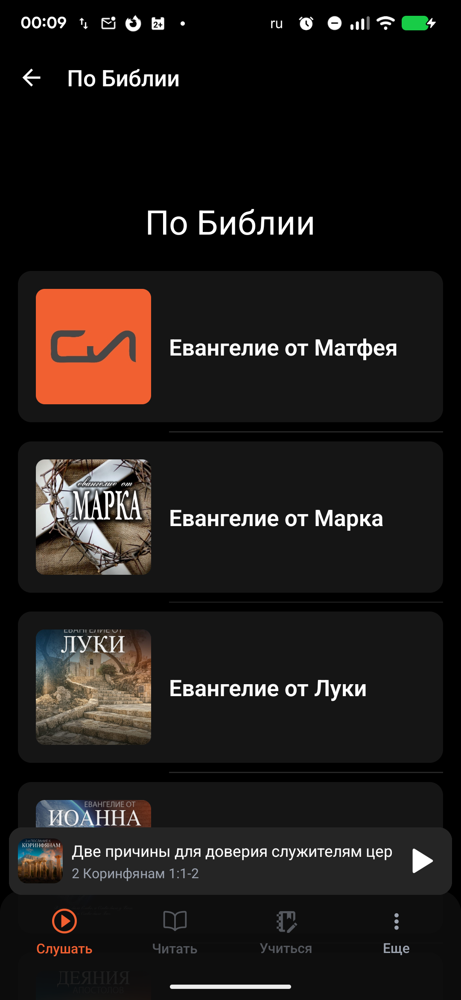
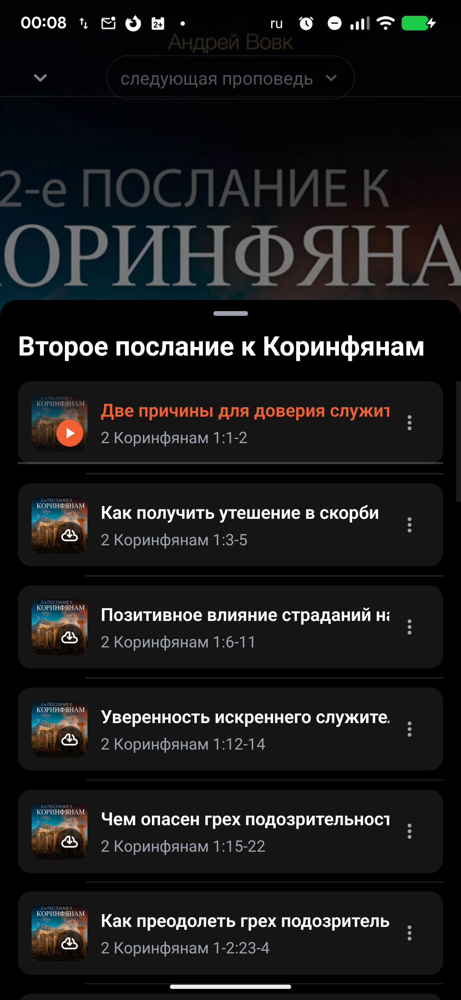
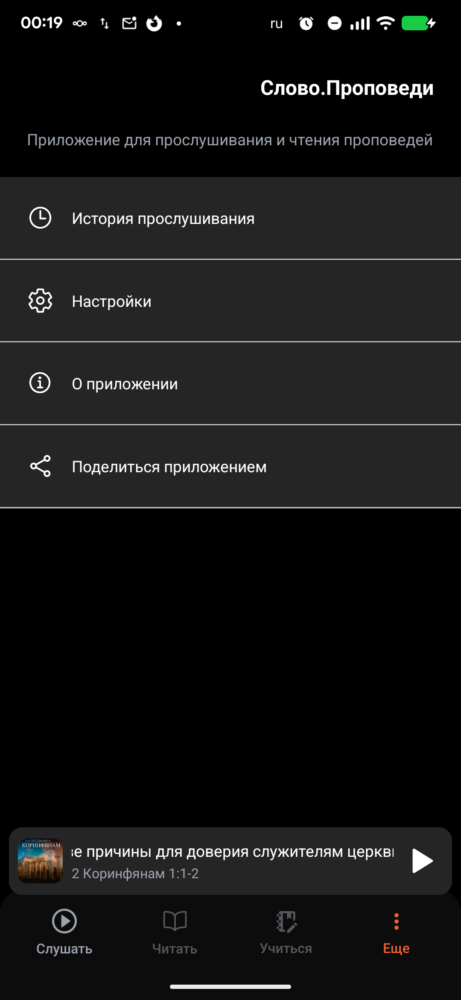
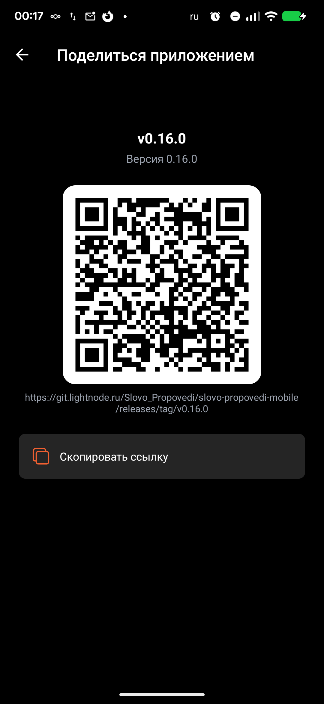

# Слово.Проповеди

[English](README.en.md) | **Русский**

> Слушайте христианские проповеди на вашем устройстве.

## Возможности

- **Аудио воспроизведение** — Потоковое воспроизведение и кеширование проповедей для прослушивания офлайн
- **Настраиваемый сервер** — Подключение к любому совместимому серверу проповедей
- **Без рекламы, без отслеживания, без аналитики** — Конфиденциальность прежде всего
- **Тёмная/светлая тема** — Выберите предпочитаемый внешний вид
- **Свободное и открытое ПО** — GPL-3.0-or-later

## Скриншоты

<table>
  <tr>
    <td align="center"> Слушать</td>
    <td align="center"> Слушать (тёмная тема)</td>
    <td align="center"> Поиск</td>
  </tr>
  <tr>
    <td align="center"> Список плейлистов</td>
    <td align="center"> Плейлист</td>
    <td align="center"> Плейлист в шторке</td>
  </tr>
  <tr>
    <td align="center"> Плеер</td>
    <td align="center"> Меню плеера</td>
    <td align="center"> История прослушивания</td>
  </tr>
</table>

<table>
  <tr>
    <td align="center"> Настройки</td>
    <td align="center"> Ещё</td>
  </tr>
  <tr>
    <td align="center"> О приложении</td>
    <td align="center"> Поделиться</td>
  </tr>
</table>

## Запланировано

- **Чтение FB2-книг** — Онлайн-чтение христианских книг в формате FB2 с сервера (без локальных файлов)

## Загрузка

### F-Droid (рекомендуется)

[Ссылка будет добавлена после публикации в F-Droid]

### Прямая загрузка APK

Скачайте последний APK со [страницы релизов](https://git.lightnode.ru/Slovo_Propovedi/slovo-propovedi-mobile/releases).

## Лицензия

Этот проект является свободным открытым программным обеспечением, распространяемым под лицензией **GNU General Public License v3.0 или новее** ([GPL-3.0-or-later](LICENSE)).

Распространение через Apple App Store и Google Play Store разрешено в соответствии с [Дополнительным разрешением для магазинов приложений](ADDITIONAL-PERMISSIONS.md).

- **Исходный код**: https://git.lightnode.ru/Slovo_Propovedi/slovo-propovedi-mobile
- **Отчёты об ошибках и связь**: https://git.lightnode.ru/Slovo_Propovedi/slovo-propovedi-mobile/issues
- **Текст лицензии**: [LICENSE](LICENSE)
- **Сторонние лицензии**: [THIRD-PARTY-LICENSES.md](THIRD-PARTY-LICENSES.md)
- **Авторы**: [AUTHORS](AUTHORS)

## Участие в разработке

См. [CONTRIBUTING.md](CONTRIBUTING.md) для настройки окружения, стандартов кода и процесса участия.

Технические детали об архитектуре проекта, системе сборки и скриптах разработки см. в [DEVELOPMENT.md](DEVELOPMENT.md).

## История изменений

См. [CHANGELOG.md](CHANGELOG.md) для полного списка изменений.
